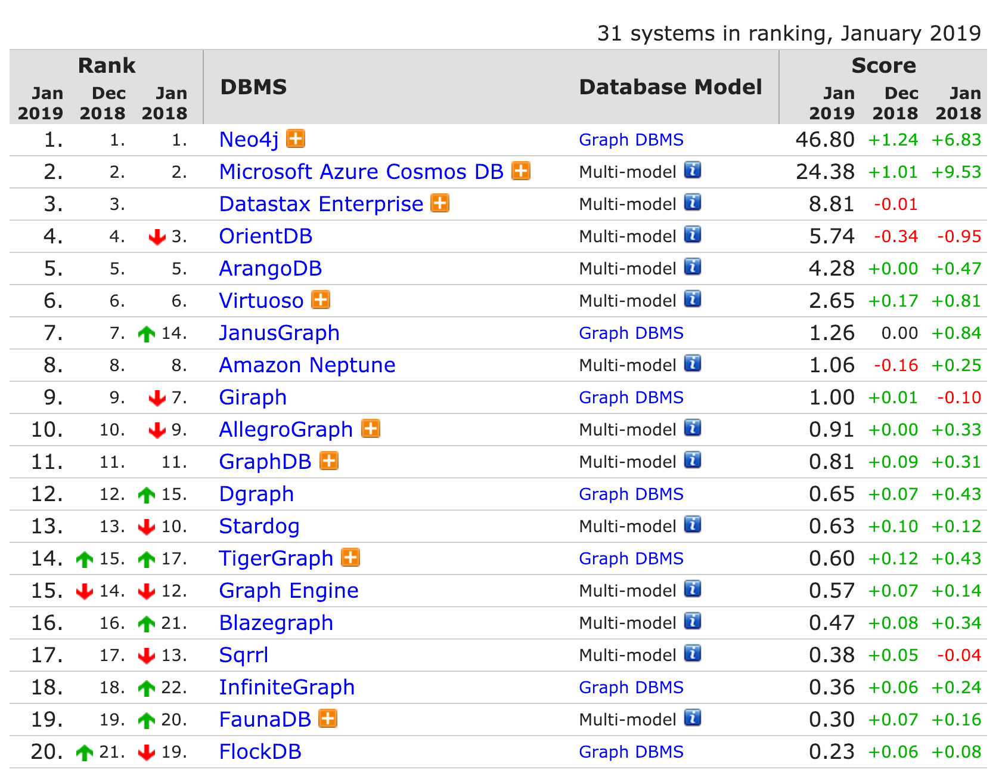

# 图数据库 

[图数据库 中文Wiki](https://zh.wikipedia.org/wiki/%E5%9B%BE%E6%95%B0%E6%8D%AE%E5%BA%93)

> 图数据库也可称为面向/基于图的数据库，对应的英文是Graph database。图数据库的基本含义是以“图”这种数据结构存储和查询数据，不是存储图片的数据库。图数据库的基本存储单元为：节点、关系、属性。

> 图数据库使用图模型来操作数据。目前使用的图模型有3种，分别是属性图（Property Graph）、资源描述框架（RDF）三元组和超图（HyperGraph）。现在较为知名的图数据库主要是基于属性图，更确切得说是带标签的属性图（Labeled-Property Graph），当然标签不是必须的。

[Graph database 英文Wiki](https://en.wikipedia.org/wiki/Graph_database)

> In computing, a graph database (GDB[1]) is a database that uses graph structures for semantic queries with nodes, edges and properties to represent and store data. A key concept of the system is the graph (or edge or relationship), which directly relates data items in the store a collection of nodes of data and edges representing the relationships between the nodes. 

### 用图来表示图示例


### 社交网络图示例


### 图数据库的优点：

1. 关系查询性能好
在一个包含100w人，每人约有50个朋友的社交网络中找到最大深度为5的朋友的朋友。下图为图数据库Neo4J和关系型数据库在寻找扩展朋友时的性能对比。


1. 灵活扩展性好
 
图天生就是灵活可扩展的，可以对已存在的图结构增加新的边、节点、标签和子图，但却不会破坏现有的查询和应用程序的功能。

1. 灵活高效的图查询语言

在图数据库中使用专门的图查询语言比使用SQL更加高效。目前主流的图查询语言是Cypher和Gremlin。

### 图数据库实现机制

原生图存储和原生图处理，其中原生图存储指的是图数据库，比如Neo4J所使用的后端存储是专门为Neo4J这种图数据库定制和优化的，理论上说能更有利于发挥图数据库的性能。而非原生图存储指的是图数据库，比如JanusGraph使用通用的NoSQL数据库比如HBase来保存序列化后的图数据。

而原生图处理指的是利用了免索引邻接的图数据库。免索引邻接是指通过边关联的2个节点，其彼此指向是物理的，也就是通过边访问一个节点时，该边保存的就是目标节点在磁盘上的物理地址，这样就需要通过索引去找到目标节点，如果边很多的时候，对性能提升很有帮助。

# 主流图数据库

[DB-Engines Ranking of Graph DBMS](https://db-engines.com/en/ranking/graph+dbms)




Neo4j占有绝对的优势，是当前业界分析知识图谱的主流数据库。

## 几种图数据库
目前图数据库领域Neo4j占据绝对的优势，但是Neo4j在具体使用中也存在一些性能方面的问题。
目前社区关注度比较高的几个框架，包括Neo4j，JanusGraph，OrientDB，ArangoDB，TigerGraph，Dgraph。

### [Neo4j](https://neo4j.com/)


Neo4j是目前使用最多的图数据库。其优点是使用起来较为简单，也提供了图上的遍历搜索算法，而且其出现的较早，文档也较为齐全。但是Neo4j 最大的缺陷在于并非是真正的分布式，当数据量超过单机的承载能力以后很难处理，不能存储一个很大的关系图（不支持分片）。同时对于超大节点的处理速度较慢。目前有很多图数据库的性能都优于Neo4j。

而且它是一个商业数据库，虽然有社区版，但是使用场景受限。

它的查询语言是Cypher：

```
MATCH (a:Person {name:'Johan'})-[:FOLLOWS]->(b)-[:FOLLOWS]->(c),        (a)-[:FOLLOWS]->(c)  RETURN b, c
```

### [JanusGraph](http://janusgraph.org/)

JanusGraph可以为不断增大的数据和用户量提供了弹性和线性的扩展能力，通过数据多点分布和复制来提高性能和容错能力；支持ACID特性和最终一致性。与Neo4J不同，JanusGraph不是原生的图数据库，相反的，其将数据存储到通用的存储系统上，支持的后端存储包括：Apache Cassandra、Apache HBase、Google Cloud Bigtable和Oracle BerkeleyDB。其中BerkeleyDB一般只做例子演示用。

JanusGraph依托于Apache社区构建了完整的图数据库和图计算能力，通过跟Apache中其他组件相配合，提供了一整套完整的图计算生态系统。其中就包括了Apache TinkerPop所提供的图查询语言Gremlin。

```
g.V().has('User','name','Johan').out('FOLLOWS').as('b').out('FOLLOWS').as('c').in('FOLLOWS').has('User','name','Johan').select('b','c').valueMap()
```

### OrientDB
OrientDB是与Neo4j一样，都是原生的图数据库（区别于在关系型数据库上封装一层算法的非原生图数据库）。OrientDB不仅可以用于做图数据库，它还支持多种模态（文档，key-values，纯文本数据等）好处是可以避免在同一个应用里使用多种数据库。其易用性与Neo4j相差不多，但在使用过程中的坑比较多（网上的评价）。

### ArangoDB
ArangoDB是一个多模态的图数据库，支持分布式存储。其易用性应该与OrientDB和Neo4j差不多，其官网上的性能评测显示在插入及查找邻居节点的任务上比OrientDB和Neo4j要好。


### TigerGraph
TigerGraph是一个 创业公司推出的一款图数据库，是首个原生并行图系统，号称是世界上最快的，最具可拓展性的图数据库。在性能上应该会比Neo4j有较大提升。目前还没有开源，文档也不是很多。

### Dgraph
DGraph 是可扩展的，分布式的，低延迟的图数据库（2017年正式发布），DGraph 的目标是提供 Google 生产水平的规模和吞吐量，在超过TB的结构数据里，为用户提供足够低延迟的实时查询。目前github上项目的star数有5000+，与Neo4j（2007年发布）相当，目前文档相对较少，但是社区比较活跃。


在这个专题中，尝试了Neo4j和JanusGraph两种图数据库。


# 图数据库和图计算引擎的关系

### 图数据库

图数据库是图数据库管理系统的简称，使用图形化的模型进行查询的数据库，通过节点、边和属性等方式来表示和存储数据，支持增删改查（CRUD）等操作。
图数据库一般用于OLTP系统中，提供在线事务处理能力。

### 图计算引擎

与图数据库对应的是图计算引擎，一般用于OLAP系统中，提供基于图的大数据分析能力。

主流的图数据库系统基本同时提供了图数据库和图计算引擎。


# 图数据库的常见应用

## 社交网络应用

社交是人与人之间的连接，以图数据模型为内在的图数据库天生适用于明显的以联系为中心的领域。在社交网络中使用图数据库可以方便得识别人/群组和他们交流的事物之间的直接或间接的联系，使用户能够高效地对其他人或事物进行打分、评论、发现彼此存在的关系和共同关系的事情。可以更加直观得了解社交网络中人与人之间如何互动、如何关联、如何以群组的形式来做事情或选择。

## 实时推荐

基于关系进行推荐。

## 地理空间管理

通信、物流、旅游已经路由计算相关领域的地理空间应用经常会使用图数据库。

比如快递送货路径


## 知识图谱

实体与实体之间的关系，适合用图来表示

## 主数据管理（Master Data Managerment）

在企业或组织中，主数据管理(MDM)包括的数据涉及用户、客户、产品、供应商、部门、区域、站点、成本中心和业务单元等。

## 授权和访问控制

图数据库可以存储那些复杂的、高度关联的、跨越数十亿参与者和资源的访问控制结构。


--- 

# 专题文章

[图数据库 ](/graph_db_0)
[1、图数据库的基本概念和主流图数据库对比， 知识图谱](/graph_db_1)
[2、Neo4j的使用：安装， Cypher， 数据管理，导入导出， 前端Html，聚类](/graph_db_2)
[3、Neo4j的Java API](/graph_db_3)
[4、JanusGraph的使用: 安装，Gremlin，数据管理，导入导出，前端HTML](/graph_db_4)
[5、Gremlin的Java API](/graph_db_5)
[6、D3展示图](/graph_db_6)
