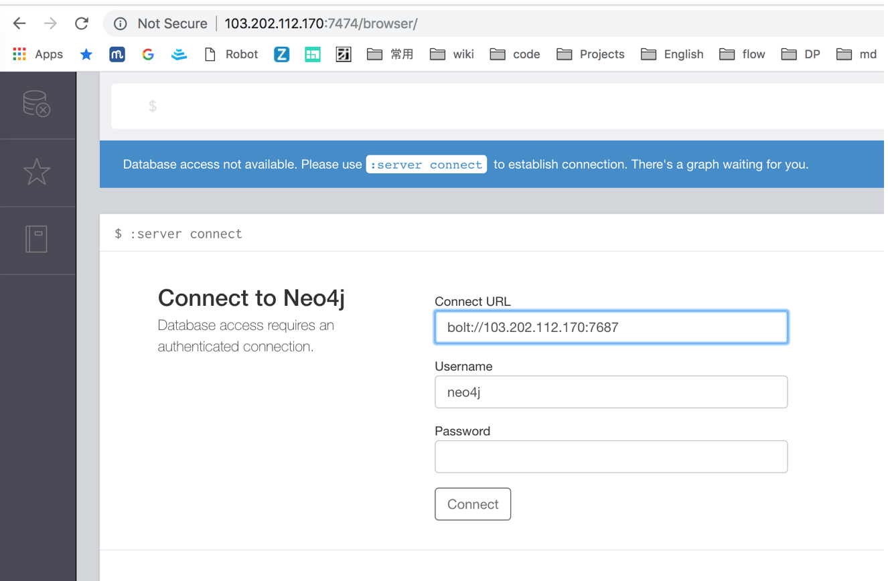

# Neo4j的使用：安装， Cypher， 数据管理，导入导出， 前端Html，聚类

##  Neo4j介绍

Neo4j是一个高性能的NOSQL图形数据库，它将结构化数据存储在网络上而不是表中。它是一个嵌入式的、基于磁盘的、具备完全的事务特性的Java持久化引擎，但是它将结构化数据存储在网络（从数学角度叫做图）上而不是表中。Neo4j也可以被看作是一个高性能的图引擎，该引擎具有成熟数据库的所有特性。程序员工作在一个面向对象的、灵活的网络结构下，而不是严格、静态的表中。但是他们可以享受到具备完全的事务特性、企业级的数据库的所有好处。 Neo4j因其嵌入式、高性能、轻量级等优势，越来越受到关注。

图数据库有巨大用途，它跟不同领域的很多问题都有关联。最常用的图论算法包括各种类型的最短路径计算、测地线（Geodesic Path）、集中度测量（如PageRank、特征向量集中度、亲密度、关系度、HITS等）。


## Neo4j安装

### 在Ubuntu上安装Neo4j

#### 前置条件：
Java8

#### 步骤：

1.下载安装

```
 wget -O - https://debian.neo4j.org/neotechnology.gpg.key | sudo apt-key add -
 
 echo 'deb http://debian.neo4j.org/repo stable/' >/tmp/neo4j.list

 mv /tmp/neo4j.list /etc/apt/sources.list.d

 apt-get update

 apt-get install neo4j
 
```
 
2.修改配置文件`/etc/neo4j/neo4j.conf`，放开IP限制
 
```
 # With default configuration Neo4j only accepts local connections.
# To accept non-local connections, uncomment this line:
dbms.connectors.default_listen_address=0.0.0.0
 
```
 
 3.重启
 
``` 
 service neo4j restart

```

4.验证：

访问 `http://server_ip:7474/browser/`



默认用户名 `neo4j`, 默认密码 `neo4j`，
登录要求修改密码。


5.运行电影关系示例

neo4j自带电影关系示例，可以运行来获取一个感性认识


以某个节点("Keanu Reeves")为中心绘图


`MATCH (a {name: "Keanu Reeves"})-[:ACTED_IN]->(m)<-[:DIRECTED]-(d) RETURN a,m,d LIMIT 10`


## Cypher查询

[官方文档](https://neo4j.com/docs/cypher-manual/3.5/)

> Cypher is a declarative graph query language that allows for expressive and efficient querying and updating of the graph. It is designed to be suitable for both developers and operations professionals. Cypher is designed to be simple, yet powerful; highly complicated database queries can be easily expressed, enabling you to focus on your domain, instead of getting lost in database access.
> 
> Cypher is inspired by a number of different approaches and builds on established practices for expressive querying. Many of the keywords, such as WHERE and ORDER BY, are inspired by SQL. Pattern matching borrows expression approaches from SPARQL. Some of the list semantics are borrowed from languages such as Haskell and Python. Cypher’s constructs, based on English prose and neat iconography, make queries easy both to write, and to read.

Cypher是Neo4j的高效图查询DSL，简单易懂，用于数据查询和管理。

一个查询示例:

```
MATCH (user)-[:friend]->(follower)
WHERE user.name IN ['Joe', 'John', 'Sara', 'Maria', 'Steve'] AND follower.name =~ 'S.*'
RETURN user.name, follower.name
```

结果示例

```
+---------------------------+
| user.name | follower.name |
+---------------------------+
| "Joe"     | "Steve"       |
| "John"    | "Sara"        |
+---------------------------+
2 rows
```

常用Cypher语句:

- 查询 `MATCH` `WHERE` `RETURN` `WITH` `ORDER BY` `LIMIT` 
- 增加 `CREATE` `SET`
- 更新 `MERGE`
- 删除 `DELETE` `REMOVE`
- 统计 `sum()` `avg()` `count()` 


## 数据管理

### 省份和城市

```
CREATE(中国:Country{title:'中国'})
CREATE(上海:City{title:'上海市'})
CREATE(:City{title:'北京市'})
CREATE(北京:City{title:'北京市'})
CREATE(北京:City{title:'北京市'})
CREATE(四川:Province{title:'四川省'})
CREATE(成都:City{title:'成都市'})

CREATE(上海)-[:OF]->(中国)
CREATE(北京)-[:OF]->(中国)
CREATE(成都)-[:OF]->(四川)-[:OF]->(中国)
```

属性名称不需要用引号

不同会话的变量不共享

在新会话增加关联，要先把原来的节点MATCH出来


### 查询 

```
MATCH (a)-[:OF]->(b) RETURN a,b LIMIT 10
```


还可以指定关系层数

```
MATCH (a)-[*1..4]->(b:Country{title:'中国'}) RETURN a,b
```

### 删除数据

```
match (n) detach delete n
```

删除指定节点和它的关系

```
MATCH (n) where id(n) = 196 DETACH DELETE n
```
### 创建技能和它们之间的关系，并更新出现次数

创建技能节点

```
MERGE (v:SKILL {name: 'Java'}) on create SET v.count = 1 on match SET v.count = v.count + 1 return v

MERGE (v:SKILL {name: 'Spring'}) on create SET v.count = 1 on match SET v.count = v.count + 1 return v
```


创建和更新关系

```
MATCH (source:SKILL {name: 'Java'})
 MATCH (dest:SKILL {name: 'Spring'}) 
 MERGE (source)-[edge:LINE]->(dest) 
  on create SET edge.count = 1 
  on match SET edge.count = edge.count + 1
```

查询

```
MATCH (a)-[v]->(b) RETURN a,v,b LIMIT 10
```

按链接强度和关联节点计数，返回Top N关联节点

```
MATCH (a:SKILL {name: "机器学习"})-[r]->(b:SKILL)  RETURN a,r,b ORDER BY r.count desc,b.count desc LIMIT 10
```


找出有最多连结数的TopN节点

```
MATCH (a:SKILL)  
WITH a, SIZE((a)-[]->()) as r_size 
ORDER BY r_size desc 
RETURN a, r_size LIMIT 10
```


前缀匹配查询,可用于Suggest，最多连结的排前面

参考 https://neo4j.com/docs/cypher-manual/current/clauses/where/

STARTS WITH和ENDS WITH是大小写敏感

```
MATCH (a:SKILL) 
WHERE a.name STARTS WITH 'ja'  
WITH a, SIZE((a)-[]->()) as r_size 
ORDER BY r_size desc return a, r_size 
LIMIT 30
```

可以用正则表达式忽略大小写

```
MATCH (a:SKILL) 
WHERE a.name =~ '(?i)j.*' 
WITH a, SIZE((a)-[]->()) as r_size 
ORDER BY SIZE(a.name) asc, r_size desc 
return a, r_size LIMIT 30
```


清洗异常数据节点

```
match (n:SKILL {name: "n"}) detach delete n
match (n:SKILL {name: "r"}) detach delete n
match (n:SKILL {name: "n1"}) detach delete n
```

添加查询索引

```
CREATE INDEX ON :SKILL (name)
```

统计总节点数量和边的数量

```
MATCH (n) return COUNT(n);
MATCH ()-[r]->() return COUNT(r);
```

## 数据导入和导出

有几种方式，比如Cypher-shell和apoc存储过程，从使用来看apoc更加灵活好用。

### cypher-shell使用

```
# cypher-shell -u neo4j -p password
Connected to Neo4j 3.4.9 at bolt://localhost:7687 as user neo4j.
Type :help for a list of available commands or :exit to exit the shell.
Note that Cypher queries must end with a semicolon.
neo4j>:help

Available commands:
  :begin    Open a transaction
  :commit   Commit the currently open transaction
  :exit     Exit the logger
  :help     Show this help message
  :history  Print a list of the last commands executed
  :param    Set the value of a query parameter
  :params   Prints all currently set query parameters and their values
  :rollback Rollback the currently open transaction

For help on a specific command type:
    :help command


For help on cypher please visit:
    https://neo4j.com/docs/developer-manual/current/cypher/
```


[不同系统下文件路径](https://neo4j.com/docs/operations-manual/current/configuration/file-locations/)

[cypher-shell参考文档](https://neo4j.com/docs/operations-manual/current/tools/cypher-shell/)

### 导出和导入数据

```
12.7. Dump and load databases
This section describes the dump and load commands of Neo4j Admin.

A Neo4j database can be dumped and loaded using the following commands:

neo4j-admin dump --database=<database> --to=<destination-path>

neo4j-admin load --from=<archive-path> --database=<database> [--force]

Limitations

The database should be shutdown before running the dump and load commands.
neo4j-admin must be invoked as the neo4j user in order to ensure the appropriate file permissions.
```

[导入CSV数据](https://neo4j.com/docs/operations-manual/current/tutorial/import-tool/)

#### 外部工具 neo4j-shell-tools

地址 https://github.com/jexp/neo4j-shell-tools


#### 导出和导入 Cypher脚本

https://neo4j.com/developer/kb/export-sub-graph-to-cypher-and-import/

### 安装APOC

https://github.com/neo4j-contrib/neo4j-apoc-procedures

### 下载 

https://github.com/neo4j-contrib/neo4j-apoc-procedures/releases/3.4.0.4 下的插件jar包，存放在$NEO$J_HOME/plugins目录下 

```
cd /var/lib/neo4j/plugins
wget https://github.com/neo4j-contrib/neo4j-apoc-procedures/releases/download/3.4.0.4/apoc-3.4.0.4-all.jar
```

### 修改安全配置


/etc/neo4j/neoj4.conf

```
dbms.security.procedures.unrestricted=apoc.*
dbms.security.procedures.whitelist=apoc.*
apoc.export.file.enabled=true
apoc.import.file.enabled=true
```

### 重启

```
systemctl restart neo4j.service
```

### 测试

在Cypher命令界面，输入

```
RETURN apoc.version()
```

```
CALL apoc.help("apoc")
```

### 导出Cypher文件

https://neo4j.com/developer/kb/export-sub-graph-to-cypher-and-import/

```
// exports the whole database incl. indexes as cypher statements to the provided file
CALL apoc.export.cypher.all('/tmp/neo4j_export.cypher',{format:'cypher-shell'})

// exports given nodes and relationships incl. indexes as cypher statements to the provided file
MATCH path = (p1:Person)-[r:KNOWS]->(p2:Person)
WITH collect(p1)+collect(p2) as export_nodes, collect(r) as export_rels
CALL apoc.export.cypher.data(export_nodes,export_rels,'/tmp/export.cypher',{format:'cypher-shell'})
YIELD file, source, format, nodes, relationships, properties, time
RETURN nodes, relationships, time;

// exports given graph object incl. indexes as cypher statements to the provided file
...
CALL apoc.graph.fromPaths([paths],'export_graph',{}) YIELD graph
CALL apoc.export.cypher.graph(graph,'/tmp/export.cypher',{format:'cypher-shell'}) YIELD time
RETURN time;

// exports nodes and relationships from the cypher statement incl. indexes as cypher statements to the provided file
CALL apoc.export.cypher.query(
'MATCH (p1:Person)-[r:KNOWS]->(p2:Person) RETURN *',
'/tmp/export.cypher',{format:'cypher-shell'});
```

注意导出的路径，需要有权限

```
➜  /data head neo4j_export.cypher
:begin
CREATE (:`SKILL`:`UNIQUE IMPORT LABEL` {`count`:3, `name`:"RocksDB", `UNIQUE IMPORT ID`:7424});
CREATE (:`SKILL`:`UNIQUE IMPORT LABEL` {`count`:4, `name`:"PhoneGap", `UNIQUE IMPORT ID`:7425});
CREATE (:`SKILL`:`UNIQUE IMPORT LABEL` {`count`:8, `name`:"SeaJS", `UNIQUE IMPORT ID`:7426});
CREATE (:`SKILL`:`UNIQUE IMPORT LABEL` {`count`:10, `name`:"Sketch", `UNIQUE IMPORT ID`:7427});
CREATE (:`SKILL`:`UNIQUE IMPORT LABEL` {`count`:2, `name`:"Congress", `UNIQUE IMPORT ID`:7428});
CREATE (:`SKILL`:`UNIQUE IMPORT LABEL` {`count`:6, `name`:"托福", `UNIQUE IMPORT ID`:7429});
CREATE (:`SKILL`:`UNIQUE IMPORT LABEL` {`count`:9, `name`:"RMI", `UNIQUE IMPORT ID`:7430});
CREATE (:`SKILL`:`UNIQUE IMPORT LABEL` {`count`:3, `name`:"异步通信", `UNIQUE IMPORT ID`:7431});
CREATE (:`SKILL`:`UNIQUE IMPORT LABEL` {`count`:6, `name`:"开发环境搭建", `UNIQUE IMPORT ID`:7432});
➜  /data tail neo4j_export.cypher
MATCH (n1:`UNIQUE IMPORT LABEL`{`UNIQUE IMPORT ID`:9338}), (n2:`UNIQUE IMPORT LABEL`{`UNIQUE IMPORT ID`:8718}) CREATE (n1)-[r:`l` {`count`:1}]->(n2);
MATCH (n1:`UNIQUE IMPORT LABEL`{`UNIQUE IMPORT ID`:8774}), (n2:`UNIQUE IMPORT LABEL`{`UNIQUE IMPORT ID`:8669}) CREATE (n1)-[r:`l` {`count`:1}]->(n2);
MATCH (n1:`UNIQUE IMPORT LABEL`{`UNIQUE IMPORT ID`:8669}), (n2:`UNIQUE IMPORT LABEL`{`UNIQUE IMPORT ID`:8774}) CREATE (n1)-[r:`l` {`count`:1}]->(n2);
:commit
:begin
MATCH (n:`UNIQUE IMPORT LABEL`)  WITH n LIMIT 20000 REMOVE n:`UNIQUE IMPORT LABEL` REMOVE n.`UNIQUE IMPORT ID`;
:commit
:begin
DROP CONSTRAINT ON (node:`UNIQUE IMPORT LABEL`) ASSERT node.`UNIQUE IMPORT ID` IS UNIQUE;
:commit
```

#### 导出数据的函数

还可以导出csv文件

```
apoc.export.csv.*
There are 4 functions documented on the GitHub.IO page:

apoc.export.csv.query(query, file, config)
apoc.export.csv.all(file, config)
apoc.export.csv.data(nodes, rels, file, config)
apoc.export.csv.graph(graph, file, config)
```


Config neo4j.conf
```
apoc.export.file.enabled=true
dbms.security.procedures.unrestricted=apoc.export.csv.*
```

Export all

```
//Tab delimiting the 'all' query
CALL apoc.export.csv.all(
   "/tmp/exportedGraph.csv", 
   {d:'\t'}
)

```
注意导出文件需要neo4j程序有写权限，一般在`/tmp`目录下，导出后再移动

Sample Data

```
➜  /data mv /tmp/exportedGraph.csv ./
➜  /data head exportedGraph.csv
"_id"	"_labels"	"partition"	"betweenness"	"pagerank"	"community"	"count"	"name"	"_start"	"_end"	"_type"	"count"	"weight"
"7424"	":SKILL"	"0"	"6.5170218717306465"	"0.15000000000000002"	"0"	"3"	"RocksDB"
"7425"	":SKILL"	"1"	"18.55605820642601"	"0.15000000000000002"	"1"	"4"	"PhoneGap"
"7426"	":SKILL"	"2"	"16.54238384132427"	"0.15000000000000002"	"2"	"8"	"SeaJS"
"7427"	":SKILL"	"3"	"50.162859929046505"	"0.15000000000000002"	"3"	"10"	"Sketch"
"7428"	":SKILL"	"4"	"0"	"0.15000000000000002"	"4"	"2"	"Congress"
"7429"	":SKILL"	"5"	"14.427055056859594"	"0.15000000000000002"	"5"	"6"	"托福"
"7430"	":SKILL"	"6"	"11.859333186417583"	"0.15000000000000002"	"6"	"9"	"RMI"
"7431"	":SKILL"	"7"	"1.5257444466409238"	"0.15000000000000002"	"7"	"3"	"异步通信"
"7432"	":SKILL"	"8"	"1.1948662975866118"	"0.15000000000000002"	"8"	"6"	"开发环境搭建"
➜  /data tail exportedGraph.csv
								"8861"	"15453"	"belongTo"	"1550"	""
								"8861"	"15434"	"belongTo"	"714"	""
								"9080"	"15345"	"belongTo"	"5234"	""
								"9080"	"15346"	"belongTo"	"775"	""
								"9080"	"15440"	"belongTo"	"233"	""
								"9080"	"15349"	"belongTo"	"107148"	""
								"9080"	"15350"	"belongTo"	"39"	""
								"9080"	"15456"	"belongTo"	"4"	""
								"9080"	"15351"	"belongTo"	"1557"	""
								"9080"	"15432"	"belongTo"	"139"	""
```


导入数据

csv可以用load_csv函数
Cypher命令文件可以直接执行


## Neo4j前端展示

Neo4j提供了[`neovis.js`](https://github.com/neo4j-contrib/neovis.js/)来做前端展示

`neovis.js`的使用比较简单，用一个html文件就可以展示Cypher查询结果

```
<html>
    <head>
        <title>DataViz</title>
        <style type="text/css">
            #viz {
                width: 1600px;
                height: 1000px;
            }
        </style>
        <script src="https://rawgit.com/neo4j-contrib/neovis.js/master/dist/neovis.js"></script>
    </head>   
    <script>
        function draw() {
            var config = {
                container_id: "viz",
                server_url: "bolt://july:7687",
                server_user: "neo4j",
                server_password: "Yaongli@2018",
                labels: {
                    "SKILL": {
                        caption: "name",
                        size: "pagerank",
                        community: "community"
                    }
                },
                relationships: {
                    "l": {
                        caption: false,
                        thickness: "weight"
                    }
                },
                initial_cypher: "MATCH p=(n:SKILL)-[r:l]->(m:SKILL) where r.weight > 0.05 and n.count >= m.count RETURN p"
            }
            var viz = new NeoVis.default(config);
            viz.render();
        }
    </script>
    <body onload="draw()">
        <div id="viz"></div>
    </body>
</html>
```

对数据做聚类分析预处理, 计算`community`和`pagerank`。

```
预处理

match (n)-[r:l]->(m) where r.count < 50 delete r

match (n:SKILL)-[r:l]->(m:SKILL) with n,r,m SET r.weight=1.0 * r.count/(n.count + m.count)

CALL algo.pageRank('SKILL', 'l',{
  iterations:20, dampingFactor:0.85, write: true, writeProperty:"pagerank", weightProperty: "weight"
})
YIELD nodes, iterations, loadMillis, computeMillis, writeMillis, dampingFactor, write, writeProperty


CALL algo.labelPropagation("SKILL", "l", 'OUTGOING', {iterations:6,
    weightProperty:'weight', partitionProperty:'partition', write:true, concurrency:1})
YIELD nodes, iterations, didConverge, loadMillis, computeMillis, writeMillis, write, weightProperty, partitionProperty


CALL algo.louvain('SKILL', 'l',
  { weightProperty:'weight', write:true, writeProperty:'community'})
YIELD nodes, communityCount, iterations, loadMillis, computeMillis, writeMillis;

```

调整CQL中的r.weight权重，可以查看不同连接强度的图。

```
MATCH p=(n:SKILL)-[r:l]->(m:SKILL) where r.weight > 0.05 and n.count >= m.count RETURN p
```


```
MATCH p=(n:SKILL)-[r:l]->(m:SKILL) where r.weight > 0.1 and n.count >= m.count RETURN p
```


```
MATCH p=(n:SKILL)-[r:l]->(m:SKILL) where r.weight > 0.02 and n.count >= m.count RETURN p
```


## Neo4j聚类分析

在[APOC](https://github.com/neo4j-contrib/neo4j-apoc-procedures)集合中，有一系列的聚类算法函数，可以直接使用，比如之前绘图用的`algo.pageRank`和`algo.labelPropagation`等算法。

[neo4j-graph-algorithms](https://github.com/neo4j-contrib/neo4j-graph-algorithms)

### 介数中心性（Betweenness Centrality）

```
MATCH (c:SKILL)
WITH collect(c) AS characters
CALL apoc.algo.betweenness(['l'], characters, 'BOTH') YIELD node, score
SET node.betweenness = score
RETURN node.name AS name, score ORDER BY score DESC
LIMIT 100
```

### 社区发现

```
CALL algo.louvain('SKILL', 'l',
  {write:true, writeProperty:'community'})
YIELD nodes, communityCount, iterations, loadMillis, computeMillis, writeMillis;
```

nodes|communityCount|iterations|loadMillis|computeMillis|writeMillis
----|-----|----|----|-----|----
|1470   | 8               |2           |432         |820            |442          |


### PageRank

```
CALL algo.pageRank('Page', 'LINKS',{
  iterations:20, dampingFactor:0.85, write: true, writeProperty:"pagerank", weightProperty: "count"
})
YIELD nodes, iterations, loadMillis, computeMillis, writeMillis, dampingFactor, write, writeProperty
```

### 标签传播

```
CALL algo.labelPropagation("SKILL", "l", 'OUTGOING', {iterations:6,
    weightProperty:'count', partitionProperty:'partition', write:true, concurrency:4})
YIELD nodes, iterations, didConverge, loadMillis, computeMillis, writeMillis, write, weightProperty, partitionProperty
```

参考 [基于社区发现算法和图分析Neo4j解读 《权力的游戏》](https://itimetraveler.github.io/2016/11/21/%E5%9F%BA%E4%BA%8E%E7%A4%BE%E5%8C%BA%E5%8F%91%E7%8E%B0%E7%AE%97%E6%B3%95%E5%92%8C%E5%9B%BE%E5%88%86%E6%9E%90Neo4j%E8%A7%A3%E8%AF%BB%E3%80%8A%E6%9D%83%E5%8A%9B%E7%9A%84%E6%B8%B8%E6%88%8F%E3%80%8B)


--- 

# 专题文章

[图数据库 ](/graph_db_0)

[1、图数据库的基本概念](/graph_db_1)

[2、Neo4j的使用：安装， Cypher， 数据管理，导入导出， 前端Html，聚类](/graph_db_2)

[3、Neo4j的Java API](/graph_db_3)

[4、JanusGraph的使用: 安装，Gremlin，数据管理，导入导出，前端HTML](/graph_db_4)

[5、Gremlin的Java API](/graph_db_5)

[6、D3展示图](/graph_db_6)