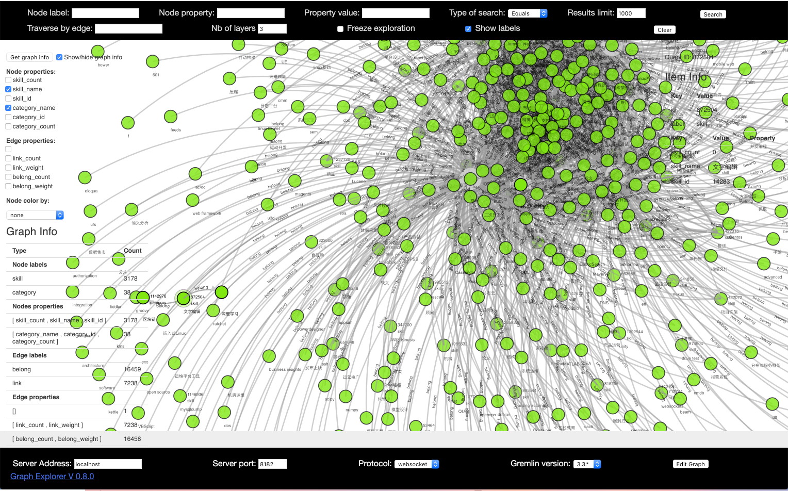

# JanusGraph的使用: 安装，Gremlin，前端HTML

 
### [](http://janusgraph.org/)


JanusGraph可以为不断增大的数据和用户量提供了弹性和线性的扩展能力，通过数据多点分布和复制来提高性能和容错能力；支持ACID特性和最终一致性。与Neo4J不同，JanusGraph不是原生的图数据库，相反的，其将数据存储到通用的存储系统上，支持的后端存储包括：Apache Cassandra、Apache HBase、Google Cloud Bigtable和Oracle BerkeleyDB。其中BerkeleyDB一般只做例子演示用。

JanusGraph依托于Apache社区构建了完整的图数据库和图计算能力，通过跟Apache中其他组件相配合，提供了一整套完整的图计算生态系统。其中就包括了Apache TinkerPop所提供的图查询语言Gremlin。

JanusGraph是一种图数据库引擎，聚焦于简洁的图序列化、丰富的图数据建模、有效的query执行。JanusGraph利用Hadoop进行图分析以及批量的图处理，JanusGraph实现了稳定的、模块化的接口，用于数据持久化、数据索引以及客户端获取，这种模块化的结构使得它能够与很多存储引擎、索引、客户端技术进行交互，也使得扩展更容易。

数据存储：Apache Cassandra（保证可用性，牺牲一致性），Apache HBase（保证一致性，牺牲可用性），Oracle Berkeley DB（非分布式）

索引：ES、Solr、Lucence


[janusgraph架构](https://docs.janusgraph.org/0.3.0/arch-overview.html)


优点

	（1）支持大图，集群横向扩展
	（2）支持多并发事务，对事务的承载能力随着集群的扩展而增加
	（3）Support for global graph analytics and batch graph processing through the Hadoop framework
	（4）支持大图的geo、大范围、全文查询
	（5）本地化支持Apache TinkerPop提出的属性图数据模型
	（6）本地化支持图遍历语句Gremlin
	（7）便于与Gremlin Server集成
	（8）支持vertex-centric索引（节点级别的索引）
	（9）优化磁盘表现
	（10）开源


### 1 安装和启动

[安装文档](https://docs.janusgraph.org/0.3.0/getting-started.html)

```
wget https://github.com/JanusGraph/janusgraph/releases/download/v0.3.1/janusgraph-0.3.1-hadoop2.zip

unzip janusgraph-0.3.1-hadoop2.zip

cd janusgraph-0.3.1-hadoop2
```

本地启动`janusgraph.sh`脚本，默认启动`Cassandra`后端、`Elasticsearch`搜索引擎和`Gremlin-Server`。
可以配置其它后端。

```
[janusgraph-0.3.1-hadoop2] bin/janusgraph.sh start
Forking Cassandra...
Running `nodetool statusthrift`.. OK (returned exit status 0 and printed string "running").
Forking Elasticsearch...
Connecting to Elasticsearch (127.0.0.1:9200)..... OK (connected to 127.0.0.1:9200).
Forking Gremlin-Server...
Connecting to Gremlin-Server (127.0.0.1:8182)..... OK (connected to 127.0.0.1:8182).
Run gremlin.sh to connect.
```

`janusgraph.sh` 脚本有如下选项

```
 start:  fork Cassandra, ES, and Gremlin-Server processes
 stop:   kill running Cassandra, ES, and Gremlin-Server processes
 status: print Cassandra, ES, and Gremlin-Server process status
 clean:  permanently delete all graph data (run when stopped)
```

### 2 使用`Gremlin`进行操作

Gremlin完整的语法可参考 [Tinkerpop 官网文档](http://tinkerpop.apache.org/docs/current/reference/#traversal)。

Gremlin是 Apache TinkerPop 框架下的图遍历语言。Gremlin是一种函数式数据流语言，可以使得用户使用简洁的方式表述复杂的属性图（property graph）的遍历或查询。每个Gremlin遍历由一系列步骤（可能存在嵌套）组成，每一步都在数据流（data stream）上执行一个原子操作。

Gremlin 语言包括三个基本的操作：

1. map-step：对数据流中的对象进行转换；
1. filter-step：对数据流中的对象就行过滤；
1. sideEffect-step：对数据流进行计算统计；

Tinkerpop3 模型核心概念:

- Graph: 维护节点&边的集合，提供访问底层数据库功能，如事务功能
- Element: 维护属性集合，和一个字符串label，表明这个element种类
- Vertex: 继承自Element，维护了一组入度，出度的边集合
- Edge: 继承自Element，维护一组入度，出度vertex节点集合.
- Property: kv键值对
- VertexProperty: 节点的属性，有一组健值对kv，还有额外的properties 集合。同时也继承自element，必须有自己的id, label.
- Cardinality: 「single, list, set」 节点属性对应的value是单值，还是列表，或者set。


#### 操作示例：

```
 bin/gremlin.sh
```

```
gremlin> graph = JanusGraphFactory.open('conf/janusgraph-berkeleyje-es.properties')
==>standardjanusgraph[berkeleyje:/Users/yangyongli/Software/JanusGraph/janusgraph-0.3.1-hadoop2/conf/../db/berkeley]
gremlin> GraphOfTheGodsFactory.load(graph)
==>null
gremlin> g = graph.traversal()
==>graphtraversalsource[standardjanusgraph[berkeleyje:/Users/yangyongli/Software/JanusGraph/janusgraph-0.3.1-hadoop2/conf/../db/berkeley], standard]
gremlin> saturn = g.V().has('name', 'saturn').next()
==>v[4104]
gremlin> g.V(saturn).valueMap()
==>[name:[saturn],age:[10000]]
gremlin>  g.V(saturn).in('father').in('father').values('name')
==>hercules
gremlin> g.E().has('place', geoWithin(Geoshape.circle(37.97, 23.72, 50)))
==>e[2rr-37c-9hx-9i0][4152-battled->12312]
==>e[35z-37c-9hx-368][4152-battled->4112]
gremlin> g.E().has('place', geoWithin(Geoshape.circle(37.97, 23.72, 50))).as('source').inV().as('god2').select('source').outV().as('god1').select('god1', 'god2').by('name')
==>[god1:hercules,god2:nemean]
==>[god1:hercules,god2:hydra]
gremlin> hercules = g.V(saturn).repeat(__.in('father')).times(2).next()
==>v[4152]
gremlin> g.V(hercules).out('father', 'mother')
==>v[4224]
==>v[8216]
gremlin> g.V(hercules).out('father', 'mother').values('name')
==>jupiter
==>alcmene
gremlin>
gremlin> gremlin>g.V(hercules).out('father', 'mother').label()
No such property: gremlin for class: groovysh_evaluate
Type ':help' or ':h' for help.
Display stack trace? [yN]
gremlin> g.V(hercules).out('father', 'mother').label()
==>god
==>human
gremlin> hercules.label()
==>demigod
gremlin> g.V(hercules).out('battled').valueMap()
==>[name:[hydra]]
==>[name:[cerberus]]
==>[name:[nemean]]
gremlin>
```

#### 使用Gremlin连接远程JanusServer服务

在`conf/remote.yaml`中配置远程连接

```
hosts: [localhost]
port: 8182
serializer: { className: org.apache.tinkerpop.gremlin.driver.ser.GryoMessageSerializerV3d0, config: { serializeResultToString: true }}%
```

启动`gremlin.sh`，对远程命令，需要加上`:>`前缀

```
gremlin> :remote connect tinkerpop.server conf/remote.yaml session
==>Configured localhost/127.0.0.1:8182-[4a226a22-a63e-4167-9810-576be129ca18]

gremlin> JanusGraphManagement management = graph.openManagement();
No such property: graph for class: groovysh_evaluate
Type ':help' or ':h' for help.
Display stack trace? [yN]


gremlin> :> JanusGraphManagement management = graph.openManagement();   PropertyKey name = management.makePropertyKey("name").dataType(String.class).make();  PropertyKey weight = management.makePropertyKey("weight").dataType(Double.class).make();  PropertyKey count = management.makePropertyKey("count").dataType(Integer.class).make();  skill = management.makeVertexLabel("skill").make();  category = management.makeVertexLabel("category").make();   link = management.makeEdgeLabel("link").make();  belong = management.makeEdgeLabel("belong").make();  management.addProperties(skill, name); management.addProperties(category, name);  management.addProperties(link, name, count, weight); management.addProperties(belong, name, count, weight);  management.commit();

```

或者用`:remote console`绑定远程Console

```
gremlin> :remote console
==>All scripts will now be sent to Gremlin Server - [localhost/127.0.0.1:8182]-[6829b5fe-8e15-4cd3-92b1-ba1fed10a069] - type ':remote console' to return to local mode
gremlin> g = graph.traversal()
==>graphtraversalsource[standardjanusgraph[cql:[127.0.0.1]], standard]
```

添加测试数据 节点和边

```
gremlin> java = g.addV("skill").property("skill_name", "Java", new Object[0]).next();
==>v[4288]
gremlin> spring = g.addV("skill").property("skill_name", "Spring", new Object[0]).next();
==>v[4192]
gremlin> java.values()
==>Java
gremlin> spring.values()
==>Spring
gremlin> jsl = java.addEdge("link", spring, "weight", 0.5);
Property value [0.5] is of type class java.math.BigDecimal is not supported
Type ':help' or ':h' for help.
Display stack trace? [yN]
gremlin> jsl = java.addEdge("link", spring, "weight", 0.5d);
==>e[1zs-3b4-bv9-38g][4288-link->4192]
gremlin> jsl.values()
==>0.5
```

```
gremlin> g.V(java).outE("link")
==>e[1lk-3b4-bv9-38g][4288-link->4192]
==>e[1zs-3b4-bv9-38g][4288-link->4192]
gremlin> g.V(java).outE("link").inV()
==>v[4192]
==>v[4192]
gremlin> g.V(java).outE("link").inV().values()
==>Spring
==>Spring

```

```
gremlin> g.V().hasLabel("skill")
==>v[4288]
==>v[4192]
gremlin> g.V().hasLabel("skill").values()
==>Java
==>Spring
```


### 前端HTML

有个项目[graphexp](https://github.com/bricaud/graphexp) 可以在Web上对JanusGraph进行查询。

这是一个纯前端项目，

```
git clone https://github.com/bricaud/graphexp.git

open graphexp/index.html
```

在浏览器打开`index.html`
输入服务器地址，修改Results Limit，然后点击Search





--- 

# 专题文章

[图数据库 ](/graph_db_0)

[1、图数据库的基本概念](/graph_db_1)

[2、Neo4j的使用：安装， Cypher， 数据管理，导入导出， 前端Html，聚类](/graph_db_2)

[3、Neo4j的Java API](/graph_db_3)

[4、JanusGraph的使用: 安装，Gremlin, 前端HTML](/graph_db_4)

[5、Gremlin的Java API](/graph_db_5)

[6、D3展示图](/graph_db_6)